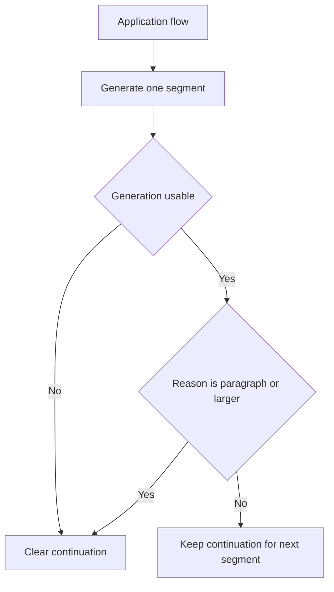
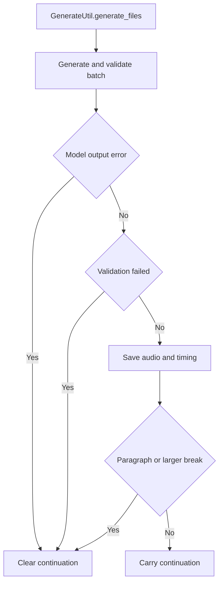

# TTS Continuation Reset Architecture

## Purpose

This document describes the current use of [`TtsBaseModel.clear_continuation()`](../tts_audiobook_tool/tts_models/tts_base_model.py:102), with emphasis on the four application flows that call it:

- audiobook file generation through [`GenerateUtil`](../tts_audiobook_tool/generate_util.py:36)
- realtime audiobook playback through [`real_time_playback.py`](../tts_audiobook_tool/real_time_playback.py:1)
- conversational LLM-to-TTS playback through [`conversation`](../tts_audiobook_tool/conversation/conversation_internals.py:1)
- the HTTP/server playback queue through [`server`](../tts_audiobook_tool/server/server.py:42)

The important architectural point is that this is a temporary pattern. The current API is a coarse global reset hook for hidden model-local continuation state. It exists because some engines, currently most concretely MOSS rolling continuation, need to bridge one generation into the next, while most of the application still treats each TTS call as an independent unit.

## Current API Shape

At the model boundary, [`TtsBaseModel.clear_continuation()`](../tts_audiobook_tool/tts_models/tts_base_model.py:102) is a no-op by default. It is documented as a hook for concrete models that cache continuation context across generation calls.

The public app-level entry points are:

- [`Tts.clear_continuation()`](../tts_audiobook_tool/tts.py:275), which calls the current model instance if one already exists.
- [`Tts.clear_continuation_if_reason()`](../tts_audiobook_tool/tts.py:282), which resets only when the segment-ending reason is in [`Tts.CONTINUATION_BREAK_REASONS`](../tts_audiobook_tool/tts.py:41).

The current continuation break reasons are:

- [`Reason.PARAGRAPH`](../tts_audiobook_tool/app_types/phrase.py:97)
- [`Reason.SPACE_BREAK`](../tts_audiobook_tool/app_types/phrase.py:101)
- [`Reason.SECTION_BREAK`](../tts_audiobook_tool/app_types/phrase.py:104)

This means continuation is currently preserved across word, phrase, and sentence boundaries, but reset across larger textual breaks.

## Why This Is Temporary

The current API does not model continuation as explicit generation input or output. Instead, the model implementation mutates private fields during generation, and unrelated orchestration code tries to decide when those fields must be thrown away.

This has several consequences:

- The caller cannot say which previous generation should be used as context.
- The caller cannot pass the previous source text, transcript, audio, tokens, or model-specific transformed continuation data explicitly.
- The caller cannot distinguish between a generation that was acoustically produced, post-processed, validated, saved, queued for playback, played, or later rejected.
- The reset decision is necessarily conservative and sometimes wrong.
- Non-MOSS models inherit the same public API even though most currently do nothing with it.

The rest of this document describes that temporary behavior as it exists today, not as a recommended long-term design.

## Current MOSS Implementation

MOSS is the concrete model that currently makes meaningful use of continuation clearing.

### Cached Fields

[`MossModel.__init__()`](../tts_audiobook_tool/tts_models/moss_model.py:23) initializes these rolling-continuation fields:

- [`MossModel.cached_continuation_text`](../tts_audiobook_tool/tts_models/moss_model.py:30), storing the previous prompt text.
- [`MossModel.cached_continuation_audio_path`](../tts_audiobook_tool/tts_models/moss_model.py:31), storing a temporary WAV path when continuation audio is file-backed.
- [`MossModel.cached_continuation_audio_codes`](../tts_audiobook_tool/tts_models/moss_model.py:32), storing encoded audio codes when in-memory continuation data is enabled.

[`MossModel.clear_continuation()`](../tts_audiobook_tool/tts_models/moss_model.py:193) resets all three pieces of state and deletes the temporary continuation WAV file through [`MossModel.clear_cached_continuation_audio_file()`](../tts_audiobook_tool/tts_models/moss_model.py:185).

### How Rolling Continuation Uses the Cache

When [`MossVoiceCloneMode.ROLLING_CONTINUATION`](../tts_audiobook_tool/tts_models/moss_base_model.py:20) is active, [`MossModel.generate()`](../tts_audiobook_tool/tts_models/moss_model.py:280) loops over each prompt in the call.

For each prompt:

1. It reads previous context from [`MossModel.cached_continuation_text`](../tts_audiobook_tool/tts_models/moss_model.py:337) and either cached audio codes or a cached audio path from [`MossModel.cached_continuation_audio_codes`](../tts_audiobook_tool/tts_models/moss_model.py:338) / [`MossModel.cached_continuation_audio_path`](../tts_audiobook_tool/tts_models/moss_model.py:338).
2. If previous text and previous audio exist, it concatenates the previous text and current prompt through [`MossModel.build_continuation_text()`](../tts_audiobook_tool/tts_models/moss_model.py:114), and calls the MOSS processor in continuation mode with the previous generated audio as the assistant audio message.
3. If no previous continuation context exists but a voice reference exists, it bootstraps from the voice reference in generation mode.
4. Otherwise, it generates without a reference.
5. After successful decoding, it stores the current prompt and generated audio through [`MossModel.cache_continuation()`](../tts_audiobook_tool/tts_models/moss_model.py:199).

The cache can store either:

- a re-encoded tensor returned by [`processor.encode_audios_from_wav()`](../tts_audiobook_tool/tts_models/moss_model.py:215), when [`MODE_CC_USE_CACHED_SOUND_DATA`](../tts_audiobook_tool/tts_models/moss_model.py:437) is enabled; or
- a temporary WAV file path written by [`soundfile.write()`](../tts_audiobook_tool/tts_models/moss_model.py:223), when file-backed continuation is used.

The default is currently file-backed continuation because [`MODE_CC_USE_CACHED_SOUND_DATA`](../tts_audiobook_tool/tts_models/moss_model.py:437) is false.

### Important Timing Detail

MOSS caches continuation immediately after model decoding inside [`MossModel.generate()`](../tts_audiobook_tool/tts_models/moss_model.py:372), before downstream post-processing, validation, file save, audio queueing, or playback completion. That timing is the root of several logic holes described below.

## Flow 1: Audiobook File Generation

Audiobook file generation is driven by [`GenerateUtil.generate_files()`](../tts_audiobook_tool/generate_util.py:39). It warms the model, builds batches, calls [`GenerateUtil.generate_and_validate_batch()`](../tts_audiobook_tool/generate_util.py:318), and then saves or retries results.

### Reset Points

The file-generation flow clears continuation in these cases:

- Out-of-memory error detected after batch generation: [`GenerateUtil.generate_files()`](../tts_audiobook_tool/generate_util.py:153).
- Validation failure, before retrying or tagging the segment as failed: [`GenerateUtil.generate_files()`](../tts_audiobook_tool/generate_util.py:219).
- User interruption at the end of generation: [`GenerateUtil.generate_files()`](../tts_audiobook_tool/generate_util.py:290).
- Model-level error returned from [`GenerateUtil.generate()`](../tts_audiobook_tool/generate_util.py:426): [`GenerateUtil.generate()`](../tts_audiobook_tool/generate_util.py:463).
- Empty output, NaN output, or post-trim silence: [`GenerateUtil.generate()`](../tts_audiobook_tool/generate_util.py:473), [`GenerateUtil.generate()`](../tts_audiobook_tool/generate_util.py:476), and [`GenerateUtil.generate()`](../tts_audiobook_tool/generate_util.py:499).
- Successful generation at a paragraph-or-larger reason boundary: [`GenerateUtil.generate()`](../tts_audiobook_tool/generate_util.py:506).

### Flow Summary

### Architectural Notes

Audiobook generation is the only requested flow that runs STT validation as a core success gate. That creates the most glaring mismatch with the current continuation cache: MOSS may cache a generated segment before the app discovers the segment is invalid. The current workaround is to call [`Tts.clear_continuation()`](../tts_audiobook_tool/tts.py:275) when validation fails.

That prevents an invalid generation from becoming the direct continuation context for later attempts, but it is not ideal because the invalid generation has already affected model-local state and may have been generated in the same batch as other outputs.

### Batched Audiobook Generation Is Not Compatible With the Current Scheme

The current continuation scheme falls down badly for real batched audiobook generation, meaning [`GenerateUtil.generate_files()`](../tts_audiobook_tool/generate_util.py:39) runs with a batch size greater than one and passes multiple prompts through [`GenerateUtil.generate()`](../tts_audiobook_tool/generate_util.py:426) in a single model call.

The issue is not just implementation roughness; it is a fundamental mismatch with the current hidden mutable cache:

- [`GenerateUtil.generate_files()`](../tts_audiobook_tool/generate_util.py:124) takes a batch of multiple indices and creates parallel [`indices`](../tts_audiobook_tool/generate_util.py:129) for one generation/validation cycle.
- [`GenerateUtil.generate()`](../tts_audiobook_tool/generate_util.py:450) converts those indices to a list of prompts and calls [`Tts.generate_using_project()`](../tts_audiobook_tool/tts.py:246) once for the whole prompt list.
- [`MossModel.generate()`](../tts_audiobook_tool/tts_models/moss_model.py:332) handles rolling continuation by mutating one model-instance cache as it loops through prompts inside that call.
- Validation happens only after the batch has already returned to [`GenerateUtil.generate_and_validate_batch()`](../tts_audiobook_tool/generate_util.py:318), so the app cannot approve or reject each generated item before MOSS uses it as context for the next item in the same batch.

That means one bad generation inside a batch can already have influenced later outputs before the validation layer detects it. It also means clearing continuation after a failed batch item is too late to protect later items in that same batch, and too coarse to preserve any known-good prior context.

For the time being, the continuation feature should be blocked for the audiobook creation workflow when real batched generation is in use. In practical terms, rolling continuation should require batch size one until a future API can represent per-item accepted continuation artifacts explicitly.

## Flow 2: Realtime Audiobook Playback

Realtime audiobook playback is driven by [`real_time_playback.start()`](../tts_audiobook_tool/real_time_playback.py:35), which loops over phrase groups and calls [`real_time_playback.generate_full_flow()`](../tts_audiobook_tool/real_time_playback.py:241) for one segment at a time.

### Reset Points

The realtime flow clears continuation in these cases:

- Outer-loop interruption after [`generate_full_flow()`](../tts_audiobook_tool/real_time_playback.py:117): [`real_time_playback.start()`](../tts_audiobook_tool/real_time_playback.py:120).
- Out-of-memory error during a generation attempt: [`real_time_playback.generate_full_flow()`](../tts_audiobook_tool/real_time_playback.py:275).
- Model failure string for an attempt: [`real_time_playback.generate_full_flow()`](../tts_audiobook_tool/real_time_playback.py:283).
- User interruption during the attempt loop: [`real_time_playback.generate_full_flow()`](../tts_audiobook_tool/real_time_playback.py:291).
- Transcript validation failure before possible retry: [`real_time_playback.generate_full_flow()`](../tts_audiobook_tool/real_time_playback.py:298).
- Final error return from the function: [`real_time_playback.generate_full_flow()`](../tts_audiobook_tool/real_time_playback.py:305).
- Successful generation at a paragraph-or-larger reason boundary: [`real_time_playback.generate_full_flow()`](../tts_audiobook_tool/real_time_playback.py:310).

### Architectural Notes

Realtime audiobook playback is structurally similar to file generation, but it normally generates one phrase group at a time and only retries when the playback buffer has enough runway. When there is no runway, validation may be skipped or retry-limited, so continuation state may be retained for outputs that would have failed under stricter validation in the file-generation path.

This is another consequence of the current implicit API: continuation follows the operational flow's success criteria rather than an explicit continuation contract.

## Flow 3: Conversation

The conversation flow is implemented mostly in [`conversation_internals.py`](../tts_audiobook_tool/conversation/conversation_internals.py:1). [`ResponseSession`](../tts_audiobook_tool/conversation/conversation_internals.py:549) breaks LLM output into TTS chunks and sends them either through non-streaming generation or through [`ConversationStreamingTts.generate_to_sound_stream()`](../tts_audiobook_tool/conversation/conversation_internals.py:455).

### Streaming Conversation Reset Points

For model-side streaming TTS, [`ConversationStreamingTts.generate_to_sound_stream()`](../tts_audiobook_tool/conversation/conversation_internals.py:455):

- calls [`Tts.generate_using_project()`](../tts_audiobook_tool/tts.py:246) with stream callbacks;
- always clears model stream callback state in a `finally` block through [`TtsBaseModel.clear_stream_state()`](../tts_audiobook_tool/tts_models/tts_base_model.py:91);
- clears continuation on generation error: [`ConversationStreamingTts.generate_to_sound_stream()`](../tts_audiobook_tool/conversation/conversation_internals.py:533);
- clears continuation on no streamed output: [`ConversationStreamingTts.generate_to_sound_stream()`](../tts_audiobook_tool/conversation/conversation_internals.py:536);
- clears by reason after a successful streamed chunk: [`ConversationStreamingTts.generate_to_sound_stream()`](../tts_audiobook_tool/conversation/conversation_internals.py:540).

### Non-Streaming Conversation Reset Points

Inside [`ResponseSession.tts_worker()`](../tts_audiobook_tool/conversation/conversation_internals.py:665), continuation is cleared on:

- pre-generation interrupt or response abort: [`ResponseSession.tts_worker()`](../tts_audiobook_tool/conversation/conversation_internals.py:671);
- post-streaming interrupt or abort: [`ResponseSession.tts_worker()`](../tts_audiobook_tool/conversation/conversation_internals.py:721);
- streaming TTS error: [`ResponseSession.tts_worker()`](../tts_audiobook_tool/conversation/conversation_internals.py:728);
- non-streaming interrupt or abort after generation: [`ResponseSession.tts_worker()`](../tts_audiobook_tool/conversation/conversation_internals.py:755) and [`ResponseSession.tts_worker()`](../tts_audiobook_tool/conversation/conversation_internals.py:771);
- non-streaming TTS error: [`ResponseSession.tts_worker()`](../tts_audiobook_tool/conversation/conversation_internals.py:761);
- empty or silent output: [`ResponseSession.tts_worker()`](../tts_audiobook_tool/conversation/conversation_internals.py:778);
- successful non-streaming chunk at a paragraph-or-larger reason boundary: [`ResponseSession.tts_worker()`](../tts_audiobook_tool/conversation/conversation_internals.py:814);
- late interrupt after queueing logic: [`ResponseSession.tts_worker()`](../tts_audiobook_tool/conversation/conversation_internals.py:817);
- unexpected exception: [`ResponseSession.tts_worker()`](../tts_audiobook_tool/conversation/conversation_internals.py:824).

Abort cleanup also explicitly clears both stream state and continuation through [`ResponseSession.abort_response()`](../tts_audiobook_tool/conversation/conversation_internals.py:933).

### Architectural Notes

Conversation has no full transcript-validation equivalent to audiobook generation. Its phrase-level STT path is used for timing/rendering and can fail gracefully without invalidating the output. Therefore continuation is mostly reset on operational failure, interruption, empty output, or semantic boundaries.

In conversation, the same model instance can persist across many user turns. The current API does not distinguish continuation within a single assistant response from continuation between assistant responses. Whether that is desirable for a model like MOSS is currently an emergent property of chunking, reasons, and interruption behavior rather than an explicit design choice.

## Flow 4: Server

The server flow is driven by [`Server._worker()`](../tts_audiobook_tool/server/server.py:444), which pulls [`PromptItem`](../tts_audiobook_tool/server/server.py:35) instances from a priority queue and generates either streaming or non-streaming output.

### Reset Points

The server clears continuation in these cases:

- Explicit API clear request: [`Server.clear()`](../tts_audiobook_tool/server/server.py:289).
- Streaming generation canceled by generation id change: [`Server.generate_streaming_output()`](../tts_audiobook_tool/server/server.py:357).
- Streaming TTS error: [`Server.generate_streaming_output()`](../tts_audiobook_tool/server/server.py:360).
- Streaming no-output result: [`Server.generate_streaming_output()`](../tts_audiobook_tool/server/server.py:364).
- Successful streaming output at a paragraph-or-larger reason boundary: [`Server.generate_streaming_output()`](../tts_audiobook_tool/server/server.py:368).
- Non-streaming TTS error: [`Server.generate_non_streaming_output()`](../tts_audiobook_tool/server/server.py:384).
- Non-streaming generation canceled by generation id change: [`Server.generate_non_streaming_output()`](../tts_audiobook_tool/server/server.py:390) and [`Server.generate_non_streaming_output()`](../tts_audiobook_tool/server/server.py:411).
- Non-streaming empty or silent output: [`Server.generate_non_streaming_output()`](../tts_audiobook_tool/server/server.py:394).
- Successful non-streaming output at a paragraph-or-larger reason boundary: [`Server.generate_non_streaming_output()`](../tts_audiobook_tool/server/server.py:424).
- Queue-worker cancellation while waiting for buffer capacity: [`Server._worker()`](../tts_audiobook_tool/server/server.py:454).
- Queue-worker cancellation before generation: [`Server._worker()`](../tts_audiobook_tool/server/server.py:462).

### Architectural Notes

The server uses a generation id as a coarse cancellation barrier. [`Server.clear()`](../tts_audiobook_tool/server/server.py:289) increments that id, clears continuation, drains the prompt queue, and clears local/HTTP audio buffers. In-flight generation cannot necessarily be stopped immediately, so the generation id checks prevent stale output from being appended and clear continuation when stale work is observed.

The server also has eager first-segment splitting in [`Server._worker()`](../tts_audiobook_tool/server/server.py:469). A subtle logic hole is that the code changes only [`prompt_text`](../tts_audiobook_tool/server/server.py:476) to the first phrase, while [`phrase_group`](../tts_audiobook_tool/server/server.py:467) remains the original group. Later pause insertion and continuation-boundary clearing use the original group's [`PhraseGroup.last_reason`](../tts_audiobook_tool/app_types/phrase.py:176) instead of the first phrase's reason. That can make continuation and pause behavior disagree with the actual generated text unit.

## Cross-Flow Logic Holes and Risks

### Invalid Generation Clears Are a Workaround

The largest issue is the current invalid-generation reset behavior. In file generation and realtime playback, a segment can be produced, cached by MOSS as the next continuation context, then rejected by STT validation. The application responds by clearing continuation after the fact.

That is safer than letting an invalid or hallucinated output become context, but it is not ideal:

- The model has already cached the rejected output.
- The retry cannot use a known-good prior generation unless that prior generation is still available elsewhere and can be explicitly supplied.
- In batch generation, one rejected item can force a global continuation reset even though other items in the batch may have been generated or saved.
- The reset throws away all continuation context, not only the bad segment.

### Generation Success Is Defined Differently in Each Flow

The four flows have different definitions of success:

- file generation requires generation, post-processing, optional STT validation, and save;
- realtime playback may skip validation or retry less aggressively when playback buffer runway is low;
- conversation accepts audio once generated and queued, without full transcript validation;
- server accepts audio once generated and appended, guarded mainly by generation id cancellation.

Because continuation is hidden in the model, each flow must manually decide whether its local success criteria justify keeping the continuation cache.

### Continuation Is Global to the Model Instance

The cache is on the model instance, not on a request, project range, stream, conversation turn, queue item, or output segment. Any flow sharing the same process and model instance inherits whatever continuation state the previous flow left behind unless the caller remembered to clear it.

This is acceptable only as a short-term operational convention.

### The API Cannot Represent Previous Generation Data

The current clear-only API cannot represent the positive case: using an explicit previous generation. It can only say discard whatever hidden state exists. A more robust design would allow the caller to supply a previous generation artifact and let the model decide how to consume it.

### Cached MOSS Text May Not Match Accepted Audio

MOSS stores the current prompt in [`MossModel.cache_continuation()`](../tts_audiobook_tool/tts_models/moss_model.py:199). That prompt is the prepared input text, not necessarily a transcript of the generated audio. If the model output deviates from the prompt but the app accepts it, future continuation text may not match the acoustic context exactly.

### Post-Processing Can Change the Accepted Audio

MOSS caches decoded model audio before app-level silence trimming, gap limiting, normalization, pause/effect appending, save, or playback. Depending on the model's expectations, it may be better to continue from raw model output, accepted post-processed speech audio, a transcript, encoded audio tokens, or some combination. The current API has no way to make that distinction explicit.

### Temporary File Lifecycle Is Hidden

When file-backed MOSS continuation is active, the continuation artifact is a temporary WAV path. [`MossModel.clear_continuation()`](../tts_audiobook_tool/tts_models/moss_model.py:193) deletes it, and [`MossModel.kill()`](../tts_audiobook_tool/tts_models/moss_model.py:119) also clears continuation. This works for the current single-cache pattern, but it couples lifecycle management to global resets rather than explicit artifact ownership.

### Stray Debug Output

[`Tts.clear_continuation()`](../tts_audiobook_tool/tts.py:275) currently prints the debug string from [`Tts.clear_continuation()`](../tts_audiobook_tool/tts.py:279). That is useful for noticing the temporary reset pattern during development, but it is not a stable user-facing logging strategy and can leak into UI/server output paths.

## Better API Direction Ideas

These are intentionally non-committal directions rather than a proposed final design.

### Make Continuation an Explicit Artifact

Instead of only mutating model-private state and clearing it later, generation could return a model-specific continuation artifact alongside audio. The next request could choose to pass that artifact back.

Conceptually:

- previous source text or normalized source text;
- previous accepted transcript, when available;
- previous accepted audio, likely speech-only rather than appended silence/effects;
- model-native transformed data, such as audio codes, semantic tokens, codec tokens, hidden prompt objects, or references to cached tensors;
- metadata describing whether the artifact came from raw generation, post-processed output, validation-passed output, saved output, queued output, or played output.

### Separate Candidate Output from Accepted Output

The orchestration layer could treat model output as a candidate until validation or acceptance completes. Only accepted candidates would become eligible as continuation inputs. This would address the invalid-generation reset workaround directly.

### Let Callers Choose the Continuation Scope

Continuation scope could be attached to an audiobook run, realtime session, conversation response turn, server queue stream, or explicit request id. That would avoid accidental cross-flow carryover and make interruption/cancellation semantics clearer.

### Support Model-Specific Continuation Inputs

Different TTS models may want different continuation data. Some may optimally consume waveform audio; others may prefer tokenized audio, semantic tokens, a reference clip, prior text, transcribed text, speaker embeddings, or no continuation at all. The public API should probably describe generic previous-generation information while leaving room for model-specific preparation and caching.

### Preserve a Known-Good Previous Context

Rather than clearing all state after an invalid generation, the app could keep the last accepted continuation artifact and retry from that known-good baseline. That would be especially important for validation-and-retry flows.

### Treat Boundaries as Policy, Not Model State Mutation

Paragraph, space-break, and section-break resets are currently hardcoded in [`Tts.CONTINUATION_BREAK_REASONS`](../tts_audiobook_tool/tts.py:41). A future API could make boundary policy explicit and configurable per flow or per model, while still exposing safe defaults.

## Summary

[`TtsBaseModel.clear_continuation()`](../tts_audiobook_tool/tts_models/tts_base_model.py:102) is currently a coarse escape hatch for resetting hidden model-local continuation state. It is used throughout audiobook generation, realtime playback, conversation, and server flows to recover from failures, interruptions, cancellations, invalid generations, and semantic text boundaries.

This is serviceable as a temporary pattern, but it is not robust enough to represent rolling continuation as a first-class architecture. The likely direction is an explicit previous-generation API where callers can decide which accepted output should be eligible for continuation and models can decide whether they need audio, text, transcripts, transformed tokens, or other model-native data.
