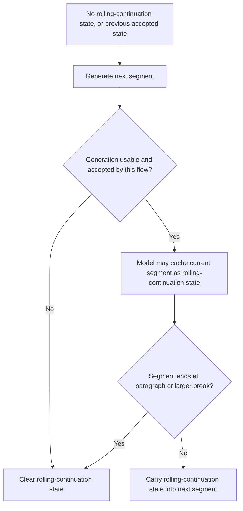

# TTS Rolling Continuation Architecture

## Purpose

This document describes the current rolling-continuation API and the four application flows that incorporate it. Here, "rolling continuation" means continuation that draws from previous generated segments. The broader term "continuation" can also describe other model behaviors, such as continuing from a fixed reference clip, so this document uses "rolling continuation" for the previous-generation case whenever possible. The canonical use case is audiobook creation, where generated text segments are processed in project order, validated, retried when needed, and saved as accepted audio segments.

The document has three main parts:

1. **Part 1** describes the app-level rolling-continuation API, the current state-machine-like behavior, its linear generation requirement, and how the four application flows use it.
2. **Part 2** describes model-specific rolling-continuation mechanics for [`moss_model.py`](../tts_audiobook_tool/tts_models/moss_model.py), [`fish_s2_model.py`](../tts_audiobook_tool/tts_models/fish_s2_model.py), and [`qwen3_base_model.py`](../tts_audiobook_tool/tts_models/qwen3_base_model.py).
3. **Part 3** records subjective listening impressions from rolling-continuation experiments.

## Part 1: Current Rolling-Continuation API and Application Flows

### API Shape

Rolling continuation is exposed as a small reset-oriented API at the TTS boundary:

- [`TtsBaseModel.clear_continuation()`](../tts_audiobook_tool/tts_models/tts_base_model.py:102) is the model hook. The base implementation is a no-op; concrete models that cache rolling-continuation context override it to clear model-specific text, audio, token, or prompt state.
- [`Tts.clear_continuation()`](../tts_audiobook_tool/tts.py:278) is the app-level reset function. It gets the currently instantiated model, if any, and calls the model hook.
- [`Tts.clear_continuation_if_reason()`](../tts_audiobook_tool/tts.py:284) applies the standard text-boundary policy. It clears only when the segment-ending reason is included in [`Tts.CONTINUATION_BREAK_REASONS`](../tts_audiobook_tool/tts.py:41).

The current standard break reasons are:

- [`Reason.PARAGRAPH`](../tts_audiobook_tool/app_types/phrase.py:97)
- [`Reason.SPACE_BREAK`](../tts_audiobook_tool/app_types/phrase.py:101)
- [`Reason.SECTION_BREAK`](../tts_audiobook_tool/app_types/phrase.py:104)

Therefore, rolling continuation can span smaller text boundaries such as word, phrase, and sentence boundaries, but is reset at paragraph-or-larger breaks.

### Operational Model

The rolling-continuation API works like a small state machine owned by the active model instance:

The important behavior is not only the explicit clear call. Concrete models that support rolling continuation may update their cached rolling-continuation context during generation itself. After that happens, the app either keeps that updated state for the next segment or calls [`Tts.clear_continuation()`](../tts_audiobook_tool/tts.py:278) to discard it.

This gives the API clear semantics:

- A successful, accepted segment can become the context for the next segment.
- A paragraph, space break, or section break ends the current rolling-continuation chain.
- A model error, exception, cancellation, interruption, empty output, silence output, invalid numeric output, or app-level validation failure resets the chain.
- A reset does not rewind to the last accepted segment. It clears the model-local rolling-continuation state.

### Linear Generation Requirement

Rolling continuation requires linear generation. For the rolling-continuation state to be correct, each segment must go through this sequence before the next segment depends on it:

1. Generate the current segment.
2. Apply post-processing and flow-specific acceptance checks.
3. If accepted, keep the model's updated rolling-continuation state unless the segment boundary ends the chain.
4. If rejected or interrupted, clear the rolling-continuation state before retrying or moving on.

That sequence is incompatible with real batched rolling continuation. If multiple prompts are generated in one model call, the model can advance internal rolling-continuation state from one generated item to the next before the application has validated or rejected each individual item. In a validation-and-retry flow, a bad generation inside a batch can already have influenced later items by the time the app discovers the failure.

For that reason, rolling continuation is gated to batch size 1 where the app can enforce it. MOSS blocks rolling continuation with [`project.moss_batch_size`](../tts_audiobook_tool/tts_models/moss_base_model.py:75) greater than one. Qwen3 blocks rolling continuation with [`project.qwen3_batch_size`](../tts_audiobook_tool/tts_models/qwen3_base_model.py:127) greater than one and also rejects multiple prompts inside base-mode rolling continuation through [`Qwen3Model.generate_base()`](../tts_audiobook_tool/tts_models/qwen3_model.py:244). Fish S2's wrapper is inherently linear for its project path because [`FishS2Model.generate_using_project()`](../tts_audiobook_tool/tts_models/fish_s2_model.py:220) rejects prompt lists whose length is not one.

### Mid-Paragraph Resets

Rolling continuation can break even in the middle of a paragraph. This is a necessary consequence of the current state-machine-like API.

The app preserves rolling continuation across sentence and smaller boundaries only while each step in the chain is usable according to the active flow. If an exception or rejection occurs mid-paragraph, the chain is cleared even though the textual boundary would normally preserve rolling continuation. These mid-paragraph reset cases include:

- actual model exceptions or model-level error strings;
- out-of-memory errors;
- interruptions and cancellation barriers;
- empty, silent, or invalid generated audio;
- app validation failures, especially STT transcript validation failures in audiobook creation and realtime playback.

When this happens, the next attempt or next segment starts without the generated rolling-continuation chain. The current API does not retain a separate known-good rolling-continuation artifact that can be restored after a failed candidate. As a result, a mid-paragraph failure breaks continuity from that point forward until new rolling-continuation state is accumulated.

### Concrete Model Users at a Glance

The app-level API is generic, but three current model paths make concrete use of rolling-continuation state:

- [`MossModel`](../tts_audiobook_tool/tts_models/moss_model.py:22) supports MOSS continuation modes, including rolling continuation that can feed previous generated audio/text into a later generation.
- [`FishS2Model`](../tts_audiobook_tool/tts_models/fish_s2_model.py:18) keeps rolling generated semantic-token history and can clear or rebuild prompt reference context.
- [`Qwen3Model`](../tts_audiobook_tool/tts_models/qwen3_model.py:16) keeps rolling codec-code/text history for Qwen3 Base voice-clone continuation; [`Qwen3BaseModel`](../tts_audiobook_tool/tts_models/qwen3_base_model.py:127) also provides readiness gating for batch size.

Part 2 describes those model-specific mechanics in detail.

## Flow 1: Audiobook Creation (Canonical Flow)

Audiobook creation is the canonical rolling-continuation use case because it has the strongest definition of an accepted output. [`GenerateUtil.generate_files()`](../tts_audiobook_tool/generate_util.py:39) walks project text segments, generates audio, optionally validates the generated speech against source text, retries failed items, and saves accepted segment files.

### Core Sequence

For each batch selected by [`GenerateUtil.generate_files()`](../tts_audiobook_tool/generate_util.py:125):

1. The selected segment indices are passed to [`GenerateUtil.generate_and_validate_batch()`](../tts_audiobook_tool/generate_util.py:319).
2. [`GenerateUtil.generate()`](../tts_audiobook_tool/generate_util.py:429) converts those indices into prompts and calls [`Tts.generate_using_project()`](../tts_audiobook_tool/tts.py:249).
3. Model output is normalized through generation post-processing, including empty-output checks, NaN checks, silence trimming, token-noise trimming, silence-gap limiting, and final silence checks.
4. If STT validation is active, [`Validator.validate()`](../tts_audiobook_tool/generate_util.py:401) decides whether the generated speech matches the expected source text.
5. Accepted results are saved through [`GenerateUtil.save_sound_and_timing_json()`](../tts_audiobook_tool/generate_util.py:253).

This flow treats rolling continuation as valid only if the candidate survives the generation, post-processing, validation, and save path for that segment.

### Reset Points

Audiobook creation clears rolling continuation when:

- batch generation reports an out-of-memory error in [`GenerateUtil.generate_files()`](../tts_audiobook_tool/generate_util.py:155);
- validation fails before retry or failed tagging in [`GenerateUtil.generate_files()`](../tts_audiobook_tool/generate_util.py:220);
- generation is interrupted in [`GenerateUtil.generate_files()`](../tts_audiobook_tool/generate_util.py:291);
- the model returns an error string in [`GenerateUtil.generate()`](../tts_audiobook_tool/generate_util.py:466);
- generated audio is empty, NaN-containing, or becomes silence after trimming in [`GenerateUtil.generate()`](../tts_audiobook_tool/generate_util.py:476);
- an accepted segment ends at a paragraph-or-larger boundary through [`Tts.clear_continuation_if_reason()`](../tts_audiobook_tool/tts.py:284), called from [`GenerateUtil.generate()`](../tts_audiobook_tool/generate_util.py:523).

### Why Batch Size 1 Matters Most Here

Audiobook creation is also the clearest example of the batch-size limitation. The app's validation result is known only after [`GenerateUtil.generate()`](../tts_audiobook_tool/generate_util.py:429) has returned audio for the selected prompt list and [`GenerateUtil.generate_and_validate_batch()`](../tts_audiobook_tool/generate_util.py:319) has transcribed and validated each item.

If rolling continuation were used with a real multi-item batch, item 2 could be generated using item 1 as rolling-continuation context before item 1 has passed validation. If item 1 later fails validation, clearing rolling continuation is correct for future work but cannot undo item 1's influence on item 2 inside the already-completed batch. This is why rolling-continuation-capable model paths must run audiobook creation linearly when rolling continuation is active.

### Validation Failures as Rolling-Continuation Breaks

STT validation failures are not model exceptions, but they are treated as rolling-continuation-breaking events. From the rolling-continuation state machine's perspective, a generated segment that does not pass app validation is not accepted as the next state. Clearing rolling continuation prevents the rejected candidate from being reused as context for a retry or later segment.

The limitation is that the current API clears the rolling-continuation state; it does not restore the previous accepted state. Therefore, a validation failure in the middle of a paragraph breaks the existing rolling-continuation chain even though the paragraph boundary policy would otherwise preserve it.

## Flow 2: Realtime Audiobook Playback

Realtime audiobook playback uses the same generation/validation machinery, but in a single-segment loop. [`real_time_playback.generate_full_flow()`](../tts_audiobook_tool/real_time_playback.py:241) calls [`GenerateUtil.generate_and_validate_batch()`](../tts_audiobook_tool/generate_util.py:319) with one index at a time.

Rolling continuation is cleared on out-of-memory errors, model failures, interruptions, validation failures, and final error returns. On success, [`real_time_playback.generate_full_flow()`](../tts_audiobook_tool/real_time_playback.py:310) clears only if the segment reason is a paragraph-or-larger break.

The realtime flow is naturally closer to the linear rolling-continuation requirement than batched audiobook creation because it generates one phrase group at a time. However, validation can be skipped or retry-limited when playback runway is low, so its acceptance criteria can be less strict than offline audiobook creation.

## Flow 3: Conversation TTS

Conversation TTS breaks LLM responses into TTS chunks and can use either streaming or non-streaming output. Streaming generation is handled by [`ConversationStreamingTts.generate_to_sound_stream()`](../tts_audiobook_tool/conversation/conversation_internals.py:457); non-streaming generation is handled inside [`ResponseSession.tts_worker()`](../tts_audiobook_tool/conversation/conversation_internals.py:665).

Rolling continuation is cleared on TTS errors, no streamed output, empty non-streaming output, interrupts, aborts, and unexpected exceptions. On successful chunks, conversation clears by reason through [`Tts.clear_continuation_if_reason()`](../tts_audiobook_tool/tts.py:284).

Conversation does not have the same full transcript-validation gate as audiobook creation. Its acceptance point is mostly operational: audio was generated, queued or streamed, and not interrupted or aborted. Because the same model instance can persist across turns, explicit abort cleanup also clears rolling continuation through [`ResponseSession.abort_response()`](../tts_audiobook_tool/conversation/conversation_internals.py:933).

## Flow 4: Server Queue Generation

The server flow queues prompt items and generates audio in a background worker. [`Server.clear()`](../tts_audiobook_tool/server/server.py:289) is the explicit reset endpoint: it advances the generation id, clears rolling continuation, drains the prompt queue, and clears audio buffers.

During generation, streaming output uses [`Server.generate_streaming_output()`](../tts_audiobook_tool/server/server.py:302) and non-streaming output uses [`Server.generate_non_streaming_output()`](../tts_audiobook_tool/server/server.py:371). Both paths clear rolling continuation on TTS errors, cancellation by generation-id mismatch, no-output or empty-output cases, and paragraph-or-larger success boundaries.

The server's generation id acts as a cancellation barrier. If a clear request or newer generation invalidates in-flight work, the stale output is not appended and rolling continuation is reset so stale state does not carry into later queue items.

## Cross-Flow Summary

Across all four flows, the app follows the same policy:

- preserve rolling continuation only after a flow-specific accepted generation;
- clear rolling continuation at paragraph, space-break, and section-break boundaries;
- clear rolling continuation on exceptions, rejected candidates, interruptions, cancellation, or unusable output;
- require linear generation for rolling continuation, with batch size 1 where batching could otherwise violate acceptance order.

The important limitation is that the API models only the current model-local rolling-continuation state and the operation to clear it. It does not expose an explicit previous-generation artifact, does not let callers choose among multiple accepted prior segments, and does not rewind from a failed candidate to the previous accepted candidate. Those limitations explain both the batch-size-1 requirement and the way mid-paragraph exceptions or validation failures necessarily break the rolling-continuation chain.

## Part 2: Model-Specific Rolling-Continuation Details

The rolling-continuation implementations described here are experimental in the app UI. The modes are tagged as experimental in their enum labels:

- [`MossVoiceCloneMode.ROLLING_CONTINUATION`](../tts_audiobook_tool/tts_models/moss_base_model.py:199)
- [`FishS2VoiceCloneMode.ROLLING_CONTINUATION`](../tts_audiobook_tool/tts_models/fish_s2_base_model.py:32)
- [`Qwen3VoiceMode.ROLLING_CONTINUATION`](../tts_audiobook_tool/tts_models/qwen3_base_model.py:247)

The experimental label is especially appropriate because each implementation has to adapt a different model/library API into the same app-level rolling-continuation contract. The app does not have a common model-native "previous accepted generation" object. Instead, each wrapper chooses the closest input form that the underlying library already accepts.

### MOSS

MOSS exposes a library-level conversation interface through the Hugging Face remote-code processor and model. The app uses that interface in two distinct ways:

- [`MossVoiceCloneMode.CONTINUATION`](../tts_audiobook_tool/tts_models/moss_base_model.py:194) is not part of the rolling-continuation umbrella. It uses fixed reference audio plus that reference audio's transcript, then asks the model to continue from the reference. It does not draw context from previous app-generated segments.
- [`MossVoiceCloneMode.ROLLING_CONTINUATION`](../tts_audiobook_tool/tts_models/moss_base_model.py:199) is the previous-generation mode. It feeds recent generated segments back into the next generation.

The underlying MOSS API mechanics are conversation-oriented. [`MossModel.generate_outputs()`](../tts_audiobook_tool/tts_models/moss_model.py:151) passes a list of processor-built conversations into [`processor(..., mode=processor_mode)`](../tts_audiobook_tool/tts_models/moss_model.py:162), then calls [`model.generate()`](../tts_audiobook_tool/tts_models/moss_model.py:174). In rolling continuation, [`MossModel.generate()`](../tts_audiobook_tool/tts_models/moss_model.py:340) first builds the generated-history reference through [`MossModel.build_rolling_continuation_reference()`](../tts_audiobook_tool/tts_models/moss_model.py:258). When that history is non-empty, the wrapper uses:

- a user message from [`processor.build_user_message()`](../tts_audiobook_tool/tts_models/moss_model.py:376), whose text is the cached generated prompt history plus the current prompt via [`MossModel.build_continuation_text()`](../tts_audiobook_tool/tts_models/moss_model.py:129);
- an assistant message from [`processor.build_assistant_message()`](../tts_audiobook_tool/tts_models/moss_model.py:381), whose [`audio_codes_list`](../tts_audiobook_tool/tts_models/moss_model.py:382) contains the cached generated audio-code tensors;
- [`processor_mode = "continuation"`](../tts_audiobook_tool/tts_models/moss_model.py:386), which selects the MOSS processor's continuation interpretation for that conversation.

When no generated rolling-continuation state exists yet, MOSS bootstraps from the configured voice reference when available. That branch uses [`reference=[voice_reference]`](../tts_audiobook_tool/tts_models/moss_model.py:398) in a generation-mode user message, not a generated-history assistant message. When generated history exists and a fixed voice reference is still configured, the continuation user message also carries [`reference=[voice_reference]`](../tts_audiobook_tool/tts_models/moss_model.py:379), so MOSS receives both the original clone reference and the rolling generated audio-code history.

After model output is decoded, [`MossModel.decode_outputs_to_sounds_and_audio()`](../tts_audiobook_tool/tts_models/moss_model.py:184) returns both app [`Sound`](../tts_audiobook_tool/app_types/__init__.py) objects and decoded audio tensors. [`MossModel.cache_continuation()`](../tts_audiobook_tool/tts_models/moss_model.py:214) re-encodes the generated waveform with [`processor.encode_audios_from_wav()`](../tts_audiobook_tool/tts_models/moss_model.py:235), then appends the current prompt text and generated audio-code tensor to [`MossModel.cached_continuation_history`](../tts_audiobook_tool/tts_models/moss_model.py:31).

This makes MOSS structurally similar to Fish S2 and Qwen3: the cache is a list of accepted generated prompt/artifact pairs rather than one replacement slot. The artifact type differs by model. MOSS stores generated MOSS audio codes, Fish S2 stores generated semantic tokens, and Qwen3 stores generated codec codes.

MOSS now uses the same simple hybrid app-level history budget shape as Fish S2 and Qwen3. [`MossModel.cache_continuation()`](../tts_audiobook_tool/tts_models/moss_model.py:214) appends the newest accepted prompt/code pair, then prunes oldest entries while either the user-configured segment limit from [`project.moss_rolling_cont`](../tts_audiobook_tool/project.py:226) or the shared word limit from [`ROLLING_CONTINUATION_MAX_WORDS`](../tts_audiobook_tool/constants_config.py:65) is exceeded. The budget check lives in [`MossModel.is_continuation_history_over_budget()`](../tts_audiobook_tool/tts_models/moss_model.py:242), and word counting is done by [`MossModel.get_continuation_history_word_count()`](../tts_audiobook_tool/tts_models/moss_model.py:248).

[`MossModel.clear_continuation()`](../tts_audiobook_tool/tts_models/moss_model.py:210) clears [`MossModel.cached_continuation_history`](../tts_audiobook_tool/tts_models/moss_model.py:31). Voice-reference audio codes are cached separately through [`MossModel.get_voice_codes()`](../tts_audiobook_tool/tts_models/moss_model.py:274), but rolling-continuation generation currently passes the reference path to the MOSS processor instead of reusing [`MossModel.cached_voice_codes`](../tts_audiobook_tool/tts_models/moss_model.py:30).

### Fish S2

Fish S2 rolling continuation adapts Fish Speech's text-to-semantic and DAC-codec pipeline. The app does not feed previous waveform audio back into the library. Instead, it caches and reuses semantic tokens generated by Fish's text-to-semantic model.

The library-level path has three major phases in [`FishS2Model.generate()`](../tts_audiobook_tool/tts_models/fish_s2_model.py:284):

1. Encode the fixed voice reference through the DAC model, if needed. [`dac_model.encode()`](../tts_audiobook_tool/tts_models/fish_s2_model.py:312) converts the reference waveform into prompt tokens, cached on [`VoiceClone.prompt_tokens`](../tts_audiobook_tool/tts_models/fish_s2_model.py:393).
2. Generate semantic tokens with Fish Speech's [`generate_long()`](../tts_audiobook_tool/tts_models/fish_s2_model.py:192) via [`FishS2Model.generate_semantic_tokens()`](../tts_audiobook_tool/tts_models/fish_s2_model.py:180).
3. Decode semantic tokens to waveform audio through [`dac_model.from_indices()`](../tts_audiobook_tool/tts_models/fish_s2_model.py:365).

Rolling continuation is implemented by extending the prompt reference given to Fish's text-to-semantic stage. [`FishS2Model.cache_continuation()`](../tts_audiobook_tool/tts_models/fish_s2_model.py:130) appends each accepted prompt and its generated semantic token tensor to [`FishS2Model.cached_continuation_history`](../tts_audiobook_tool/tts_models/fish_s2_model.py:89). [`FishS2Model.build_prompt_reference()`](../tts_audiobook_tool/tts_models/fish_s2_model.py:157) then builds two parallel prompt-reference lists:

- [`prompt_text`](../tts_audiobook_tool/tts_models/fish_s2_model.py:197), containing the voice transcript plus cached generated prompt texts;
- [`prompt_tokens`](../tts_audiobook_tool/tts_models/fish_s2_model.py:198), containing the voice prompt tokens plus cached generated semantic tokens concatenated with [`torch.cat()`](../tts_audiobook_tool/tts_models/fish_s2_model.py:176).

Those lists are passed into Fish Speech's [`generate_long()`](../tts_audiobook_tool/tts_models/fish_s2_model.py:192) as [`prompt_text`](../tts_audiobook_tool/tts_models/fish_s2_model.py:197) and [`prompt_tokens`](../tts_audiobook_tool/tts_models/fish_s2_model.py:198). In other words, the app leverages Fish's existing prompt-conditioning API by making previous generated semantic tokens look like additional reference/prompt context.

The app also disables Fish's own internal long-text chunking for this wrapper by passing [`chunk_length=FISH_S2_DISABLE_INTERNAL_CHUNKING_LENGTH`](../tts_audiobook_tool/tts_models/fish_s2_model.py:210). That keeps segmentation, cache updates, and validation semantics under the app's control.

Fish S2 uses the same simple hybrid app-level history budget shape as MOSS and Qwen3. [`FishS2Model.cache_continuation_with_budget()`](../tts_audiobook_tool/tts_models/fish_s2_model.py:133) appends the newest accepted prompt/token pair, then prunes oldest entries while either the user-configured segment limit from [`project.fish_s2_rolling_cont`](../tts_audiobook_tool/tts_models/fish_s2_model.py:268) or the shared word limit from [`ROLLING_CONTINUATION_MAX_WORDS`](../tts_audiobook_tool/constants_config.py:65) is exceeded. The budget check lives in [`FishS2Model.is_continuation_history_over_budget()`](../tts_audiobook_tool/tts_models/fish_s2_model.py:141), and word counting is done by [`FishS2Model.get_continuation_history_word_count()`](../tts_audiobook_tool/tts_models/fish_s2_model.py:147).

The remaining model-limit guard is semantic-token generation itself. If Fish's generated semantic token sequence reaches the wrapper's max-token limit, [`FishS2Model.generate_semantic_tokens()`](../tts_audiobook_tool/tts_models/fish_s2_model.py:180) returns [`FISH_S2_MAX_TOKEN_LIMIT_ERROR`](../tts_audiobook_tool/tts_models/fish_s2_model.py:397). That is reported as a generation failure and is handled by the app-level reset/retry policy described in Part 1, rather than by an internal Fish S2 retry that silently discards all generated history.

### Qwen3

Qwen3 rolling continuation is implemented for Qwen3 Base voice-clone mode. The app adapts Qwen3-TTS's in-context-learning voice-clone prompt representation rather than using custom voice or voice-design generation.

The fixed voice reference is first converted into a library [`VoiceClonePromptItem`](../tts_audiobook_tool/tts_models/qwen3_model.py:7) through [`Qwen3TTSModel.create_voice_clone_prompt()`](../tts_audiobook_tool/tts_models/qwen3_model.py:235). That object contains the reference text, speaker embedding, and reference codec codes used by the Qwen3 Base model.

When rolling history exists, [`Qwen3Model.build_continuation_voice_clone_prompt()`](../tts_audiobook_tool/tts_models/qwen3_model.py:103) constructs a new [`VoiceClonePromptItem`](../tts_audiobook_tool/tts_models/qwen3_model.py:122) that combines:

- the original reference text plus cached generated prompt texts into a single [`ref_text`](../tts_audiobook_tool/tts_models/qwen3_model.py:127);
- the original reference codec codes plus cached generated codec codes into a single [`ref_code`](../tts_audiobook_tool/tts_models/qwen3_model.py:123), concatenated with [`torch.cat()`](../tts_audiobook_tool/tts_models/qwen3_model.py:120);
- the original speaker embedding as [`ref_spk_embedding`](../tts_audiobook_tool/tts_models/qwen3_model.py:124);
- [`icl_mode=True`](../tts_audiobook_tool/tts_models/qwen3_model.py:126), so the library treats the prompt as in-context reference material.

The app then calls a local equivalent of the library's voice-clone generation path in [`Qwen3Model.generate_base_with_codes()`](../tts_audiobook_tool/tts_models/qwen3_model.py:296). This is necessary because the app needs the generated codec codes back for future rolling-continuation context. The wrapper mirrors the library path by:

1. building assistant texts with [`_build_assistant_text()`](../tts_audiobook_tool/tts_models/qwen3_model.py:308);
2. tokenizing current prompts with [`_tokenize_texts()`](../tts_audiobook_tool/tts_models/qwen3_model.py:309);
3. converting prompt items with [`_prompt_items_to_voice_clone_prompt()`](../tts_audiobook_tool/tts_models/qwen3_model.py:310);
4. tokenizing reference text with [`_build_ref_text()`](../tts_audiobook_tool/tts_models/qwen3_model.py:318);
5. calling the underlying model's [`generate()`](../tts_audiobook_tool/tts_models/qwen3_model.py:322) with [`ref_ids`](../tts_audiobook_tool/tts_models/qwen3_model.py:324), [`voice_clone_prompt`](../tts_audiobook_tool/tts_models/qwen3_model.py:325), and [`non_streaming_mode=True`](../tts_audiobook_tool/tts_models/qwen3_model.py:327);
6. decoding combined reference-plus-generated codec codes with [`speech_tokenizer.decode()`](../tts_audiobook_tool/tts_models/qwen3_model.py:343);
7. cutting the reference portion out of the decoded waveform by proportional code length in [`Qwen3Model.generate_base_with_codes()`](../tts_audiobook_tool/tts_models/qwen3_model.py:348);
8. returning the generated codec codes so [`Qwen3Model.cache_continuation()`](../tts_audiobook_tool/tts_models/qwen3_model.py:88) can store them.

Qwen3 uses the same simple hybrid app-level history budget shape as MOSS and Fish S2. [`Qwen3Model.cache_continuation()`](../tts_audiobook_tool/tts_models/qwen3_model.py:89) appends each generated prompt/code pair, then preserves the newest accepted generated history and prunes oldest segments while either the user-configured segment limit from [`project.qwen3_rolling_cont`](../tts_audiobook_tool/tts_models/qwen3_model.py:179) or the shared word limit from [`ROLLING_CONTINUATION_MAX_WORDS`](../tts_audiobook_tool/constants_config.py:65) is exceeded. The budget check lives in [`Qwen3Model.is_continuation_history_over_budget()`](../tts_audiobook_tool/tts_models/qwen3_model.py:97), and word counting is done by [`Qwen3Model.get_continuation_history_word_count()`](../tts_audiobook_tool/tts_models/qwen3_model.py:103).

Across all three model wrappers, the segment limit keeps the cache predictable and prevents many short fragments from accumulating indefinitely. The word limit makes the history window less dependent on segmenter behavior: a few long segments can carry as much text/prosodic influence as many short segments. This remains a quality-oriented soft budget, not a model architectural limit. It is intentionally simpler than a token/code-frame budget, but it better balances local timbral continuity, near-text semantic context, and expressive freedom than a fixed segment-only cap.

## Part 3: Subjective Evaluations

These notes are subjective listening impressions rather than controlled benchmark results. The rolling-continuation modes are still experimental, and the perceived benefit depends on source text, voice reference, model settings, segment length, and how often paragraph-or-larger boundaries reset history.

Across the current model set, rolling continuation tends to flatten output in all cases. The flattening is most noticeable across successive sentences that do not hit a history reset. It can make adjacent sentence deliveries feel more locally consistent, but it can also reduce expressive variation and make a run of sentences sound more samey. When paragraphs contain only a few sentences before a history reset, the effect often sounds relatively transparent.

### Qwen3-TTS

[`Qwen3Model`](../tts_audiobook_tool/tts_models/qwen3_model.py:16) appears to benefit the most from rolling continuation. In subjective testing, Qwen3-TTS exhibits the most generation-to-generation variance, although that variance is still generally tolerable. Rolling continuation helps smooth that variance, making nearby sentences sound more like they came from the same performance.

Qwen3-TTS also seems most sensitive to history length. A history length around 2 or 3 accepted generated segments appears to flatten output the most usefully. Longer context may continue to stabilize the voice, but it can also make the delivery feel less varied.

### Fish S2

[`FishS2Model`](../tts_audiobook_tool/tts_models/fish_s2_model.py:18) sits somewhere in the middle. Rolling continuation can improve local consistency, but the subjective delta is less dramatic than Qwen3-TTS and more noticeable than MOSS. Its generated-history semantic-token prompt context gives it enough recent-state information to smooth adjacent segments without always making the change obvious.

### MOSS

[`MossModel`](../tts_audiobook_tool/tts_models/moss_model.py:21) has the least generation-to-generation variance in these subjective tests, so it appears to benefit the least from rolling continuation. It also may suffer least from continuation-related degradation. That may be related to MOSS's overall generation quality being the strongest of the three in these listening impressions.

For MOSS, the practical value of rolling continuation is therefore less about correcting large instability and more about subtle local continuity. Because its non-continuation output is already comparatively stable, the trade-off between additional consistency and reduced variation is less obvious.

### Mitigation Strategy Notes

The main audible risk is a mild or not-so-mild "xerox effect": repeated continuation through several same-paragraph sentences can flatten the performance enough that the output starts to feel copied or over-conditioned. However, adding a kludgy mitigation such as forcing a history reset after a fixed number of continuation iterations is probably not worthwhile right now. The existing paragraph, space-break, and section-break reset policy already gives natural reset points, and a hard iteration reset would add another heuristic that may be hard to tune across models and texts.

For now, the better framing is experimental: keep the simple rolling-continuation controls, prefer short history windows when a model is sensitive to over-conditioning, and evaluate by listening to paragraph-scale sequences rather than isolated generated segments.
