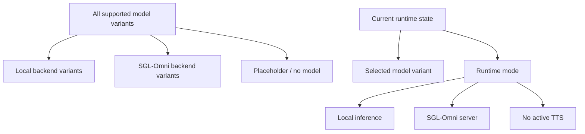

# TTS Type Refactor TODO

## Problem

[`TtsModelInfos`](../tts_audiobook_tool/tts_models/tts_model_info.py) is currently both the full catalog of supported model variants and an implicit catalog of SGL-Omni-backed variants via [`TtsModelInfo.is_sgl_omni`](../tts_audiobook_tool/tts_models/tts_model_info.py:15).

That means the list is doing double duty:

1. Model identity: which TTS variant is selected.
2. Backend grouping: whether that variant is local inference or SGL-Omni-backed.

This distinction leaks into callers such as:

- [`Tts.is_sgl_mode()`](../tts_audiobook_tool/tts.py:147)
- [`Tts.is_local_model()`](../tts_audiobook_tool/tts.py:143)
- [`Tts.init_local_model_type()`](../tts_audiobook_tool/tts.py:76)
- [`OptionsMenu.sgl_omni_type_menu()`](../tts_audiobook_tool/menus/options_menu.py:298)
- [`Prefs.sgl_omni_type`](../tts_audiobook_tool/prefs.py:410)
- generation UI branches in [`generate_menu.py`](../tts_audiobook_tool/menus/generate_menu.py)

The core smell is that SGL-Omni is a backend category, not really a model category.

## Desired distinction

Formalize these as separate concepts:

1. Model identity: the selected app-level TTS variant.
2. Backend kind: how the variant is executed or served.
3. Runtime mode: what the app is currently doing, including cases where no local model is active but SGL-Omni may be available.

## Recommended direction

Keep [`TtsModelInfos`](../tts_audiobook_tool/tts_models/tts_model_info.py:70) as the canonical app-level model catalog, but make backend classification explicit.

Avoid immediately splitting [`TtsModelInfos`](../tts_audiobook_tool/tts_models/tts_model_info.py:70) into separate unrelated enums. The app still needs one canonical selected model identity for serialization, menus, voice settings, project fields, and generation. A full split would likely increase adapter code.

Instead, use one canonical model catalog plus explicit backend classification.

## Proposed model metadata changes

Add a backend enum, for example:

- [`TtsBackendKind.LOCAL`](../tts_audiobook_tool/tts_models/tts_model_info.py)
- [`TtsBackendKind.SGL_OMNI`](../tts_audiobook_tool/tts_models/tts_model_info.py)
- [`TtsBackendKind.NONE`](../tts_audiobook_tool/tts_models/tts_model_info.py)

Replace:

- [`TtsModelInfo.is_sgl_omni`](../tts_audiobook_tool/tts_models/tts_model_info.py:15)

With something like:

- [`TtsModelInfo.backend_kind`](../tts_audiobook_tool/tts_models/tts_model_info.py)

Then call sites can ask what backend kind a model uses instead of checking an SGL-specific boolean.

## Proposed SGL-specific metadata changes

[`TtsModelInfo.server_model_id_substring`](../tts_audiobook_tool/tts_models/tts_model_info.py:17) is currently only meaningful for SGL-Omni matching.

Options:

1. Rename it to make the scope explicit, such as [`TtsModelInfo.sgl_omni_model_id_substring`](../tts_audiobook_tool/tts_models/tts_model_info.py).
2. Move it into a nested SGL-specific metadata object, such as [`TtsModelInfo.sgl_omni`](../tts_audiobook_tool/tts_models/tts_model_info.py).
3. Move SGL model-id matching into a separate registry if SGL-Omni support becomes more dynamic.

For a first pass, a rename is probably enough.

## Proposed catalog helpers

Replace scattered backend checks with named catalog queries.

Potential helpers:

- [`TtsModelInfos.get_items_by_backend()`](../tts_audiobook_tool/tts_models/tts_model_info.py)
- [`TtsModelInfos.get_local_items()`](../tts_audiobook_tool/tts_models/tts_model_info.py)
- [`TtsModelInfos.get_sgl_omni_items()`](../tts_audiobook_tool/tts_models/tts_model_info.py:632)
- [`TtsModelInfos.is_backend()`](../tts_audiobook_tool/tts_models/tts_model_info.py)

[`TtsModelInfos.get_sgl_omni_items()`](../tts_audiobook_tool/tts_models/tts_model_info.py:632) already exists, but it is currently implemented by checking [`TtsModelInfo.is_sgl_omni`](../tts_audiobook_tool/tts_models/tts_model_info.py:15). After the refactor, it should be implemented in terms of [`TtsModelInfo.backend_kind`](../tts_audiobook_tool/tts_models/tts_model_info.py).

## Runtime terminology cleanup

[`Tts.is_sgl_mode()`](../tts_audiobook_tool/tts.py:147) is currently misleading because it means “not local,” not strictly “SGL-Omni.” In particular, [`TtsModelInfos.NONE`](../tts_audiobook_tool/tts_models/tts_model_info.py:76) currently counts as this mode.

Potential replacements depend on intended behavior:

- [`Tts.is_server_tts_active()`](../tts_audiobook_tool/tts.py)
- [`Tts.uses_remote_backend()`](../tts_audiobook_tool/tts.py)
- [`Tts.should_show_sgl_omni_options()`](../tts_audiobook_tool/tts.py)
- [`Tts.is_local_model_active()`](../tts_audiobook_tool/tts.py)

The replacement should not hide the distinction between:

1. No local model found.
2. SGL-Omni URL configured but no model detected yet.
3. A known SGL-Omni-backed model is selected.

## Suggested incremental plan

### 1. Add backend classification

- Add [`TtsBackendKind`](../tts_audiobook_tool/tts_models/tts_model_info.py).
- Add [`TtsModelInfo.backend_kind`](../tts_audiobook_tool/tts_models/tts_model_info.py).
- Convert local models to [`TtsBackendKind.LOCAL`](../tts_audiobook_tool/tts_models/tts_model_info.py).
- Convert server models to [`TtsBackendKind.SGL_OMNI`](../tts_audiobook_tool/tts_models/tts_model_info.py).
- Convert [`TtsModelInfos.NONE`](../tts_audiobook_tool/tts_models/tts_model_info.py:76) to [`TtsBackendKind.NONE`](../tts_audiobook_tool/tts_models/tts_model_info.py).

### 2. Replace boolean checks

Replace checks like:

- [`item.value.is_sgl_omni`](../tts_audiobook_tool/tts_models/tts_model_info.py:635)
- [`Tts.get_type().value.is_sgl_omni`](../tts_audiobook_tool/menus/menu_status.py:23)

With explicit backend predicates or helper methods.

### 3. Rename SGL-specific fields

- Rename [`TtsModelInfo.server_model_id_substring`](../tts_audiobook_tool/tts_models/tts_model_info.py:17) to something SGL-specific.
- Update [`TtsModelInfos.find_type_item_using_sgl_omni_model_id()`](../tts_audiobook_tool/tts_models/tts_model_info.py:640) accordingly.

### 4. Clarify runtime methods

- Replace or rename [`Tts.is_sgl_mode()`](../tts_audiobook_tool/tts.py:147).
- Decide whether callers mean “server backend is active” or “local model is not active.”
- Update menus and status display accordingly.

### 5. Consider a separate SGL registry later

Only introduce a separate SGL registry if SGL-Omni grows features such as:

- dynamic discovery
- capabilities from the server
- endpoint-specific readiness checks
- backend-specific model aliases
- richer server model matching

Until then, backend classification in the main model catalog should be sufficient.

## Target outcome

The app should read as:

- model catalog logic lives in [`TtsModelInfos`](../tts_audiobook_tool/tts_models/tts_model_info.py:70)
- backend classification lives in [`TtsModelInfo.backend_kind`](../tts_audiobook_tool/tts_models/tts_model_info.py)
- SGL-Omni-specific matching lives behind explicitly named SGL helpers
- runtime state methods say exactly what state they test

This should make the SGL-Omni branch legible without turning [`TtsModelInfos`](../tts_audiobook_tool/tts_models/tts_model_info.py:70) into an implicit subgrouping mechanism.
