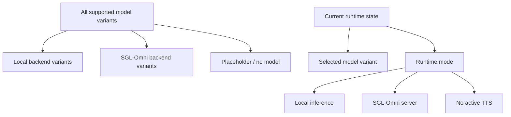

# TTS Type Refactor TODO

## Problem

[`TtsModelType`](../tts_audiobook_tool/tts_models/tts_model_type.py) is currently both the full catalog of supported model variants and an implicit catalog of SGL-Omni-backed variants via [`TtsModelSpec.is_sgl_omni`](../tts_audiobook_tool/tts_models/tts_model_type.py:17).

That means the list is doing double duty:

1. Model identity: which TTS variant is selected.
2. Backend grouping: whether that variant is local inference or SGL-Omni-backed.

This distinction leaks into callers such as:

- [`Tts.is_sgl_mode()`](../tts_audiobook_tool/tts.py:189)
- [`Tts.is_local_model()`](../tts_audiobook_tool/tts.py:185)
- [`Tts.init_local_model_type()`](../tts_audiobook_tool/tts.py:116)
- [`OptionsMenu.sgl_omni_type_menu()`](../tts_audiobook_tool/menus/options_menu.py:306)
- [`Prefs.sgl_omni_type`](../tts_audiobook_tool/prefs.py:471)
- generation UI branches in [`generate_menu.py`](../tts_audiobook_tool/menus/generate_menu.py)

The core smell is that SGL-Omni is a backend category, not really a model category.

A related smell: the SGL-backed variants already carry a `server_*` id prefix in the model identity (`server_fish_s2`, `server_higgs_v3`, `server_moss`, `server_qwen3tts`, `server_zonos2`), with a matching `*_server_*.py` module for each. So "server" is already an implicit backend signal living inside model identity. Once an explicit `backend_kind` exists, that prefix becomes redundant and should be deliberately kept or retired as part of this refactor.

## Desired distinction

Formalize these as separate concepts:

1. Model identity: the selected app-level TTS variant.
2. Backend kind: how the variant is executed or served.
3. Runtime mode: what the app is currently doing, including cases where no local model is active but SGL-Omni may be available.

```mermaid
flowchart TD
    Catalog[All supported model variants] --> Local[Local backend variants]
    Catalog --> Sgl[SGL-Omni backend variants]
    Catalog --> None[Placeholder / no model]

    Runtime[Current runtime state] --> Selected[Selected model variant]
    Runtime --> Mode[Runtime mode]

    Mode --> LocalMode[Local inference]
    Mode --> ServerMode[SGL-Omni server]
    Mode --> Unconfigured[No active TTS]
```

Note: `None` in the diagram is a placeholder member of the same `TtsModelType` enum, not a separate catalog.

## Recommended direction

Keep [`TtsModelType`](../tts_audiobook_tool/tts_models/tts_model_type.py:68) as the canonical app-level model catalog, but make backend classification explicit.

Avoid immediately splitting [`TtsModelType`](../tts_audiobook_tool/tts_models/tts_model_type.py:68) into separate unrelated enums. The app still needs one canonical selected model identity for serialization, menus, voice settings, project fields, and generation. A full split would likely increase adapter code.

Instead, use one canonical model catalog plus explicit backend classification.

## Proposed model metadata changes

Add a backend enum, for example:

- [`TtsBackendKind.LOCAL`](../tts_audiobook_tool/tts_models/tts_model_type.py)
- [`TtsBackendKind.SGL_OMNI`](../tts_audiobook_tool/tts_models/tts_model_type.py)

Do **not** add a `TtsBackendKind.NONE` member. "No active TTS" is a *runtime* state, not a way of executing a variant: [`TtsModelType.NONE`](../tts_audiobook_tool/tts_models/tts_model_type.py:74) is a catalog placeholder, not a model with a backend. Give the `NONE` placeholder an explicit sentinel (e.g., `backend_kind = None`, or a dedicated `UNSET` marker) documented as *not* a real backend. This keeps "backend kind" (a property of a model variant) separate from "no active TTS" (a runtime state), which is exactly the distinction the runtime section below wants to preserve.

Semantics note: `LOCAL` means "executes in the model's local virtualenv," not "runs on a local device." Some local models do not take a torch device parameter at all (e.g., [`MIRA`](../tts_audiobook_tool/tts_models/tts_model_type.py:370), which has an empty `local_torch_devices` list) and are still local models.

Replace:

- [`TtsModelSpec.is_sgl_omni`](../tts_audiobook_tool/tts_models/tts_model_type.py:17)

With something like:

- [`TtsModelSpec.backend_kind`](../tts_audiobook_tool/tts_models/tts_model_type.py)

Then call sites can ask what backend kind a model uses instead of checking an SGL-specific boolean.

## Proposed SGL-specific metadata changes

[`TtsModelSpec.server_model_id_substring`](../tts_audiobook_tool/tts_models/tts_model_type.py:19) is currently only meaningful for SGL-Omni matching.

Options:

1. Rename it to make the scope explicit, such as [`TtsModelSpec.sgl_omni_model_id_substring`](../tts_audiobook_tool/tts_models/tts_model_type.py).
2. Move it into a nested SGL-specific metadata object, such as [`TtsModelSpec.sgl_omni`](../tts_audiobook_tool/tts_models/tts_model_type.py).
3. Move SGL model-id matching into a registry co-located with [`SglOmniUtil`](../tts_audiobook_tool/app_support/sgl_omni_util.py:17), which already centralizes SGL runtime state (base URL, model id, readiness).

Matching fragility: the current matcher, [`TtsModelType.find_tts_type_using_sgl_omni_model_id()`](../tts_audiobook_tool/tts_models/tts_model_type.py:739), does naive substring matching against short prefixes (`"fish"`, `"higgs"`, `"qwen"`, ...). It will mis-match the moment the server exposes two models that share a prefix (e.g., `fish-s1` alongside `fish-s2`). That collision risk — not just future "dynamic discovery" — is the concrete trigger for graduating to option 3.

For a first pass, a rename (option 1) is probably enough.

## Proposed catalog helpers

Replace scattered backend checks with named catalog queries.

The primary API should be the spec field itself, `spec.backend_kind`; class-level helpers are conveniences on top, not the main query.

Potential helpers:

- [`TtsModelType.get_items_by_backend()`](../tts_audiobook_tool/tts_models/tts_model_type.py)
- [`TtsModelType.get_local_items()`](../tts_audiobook_tool/tts_models/tts_model_type.py)
- [`TtsModelType.get_sgl_omni_items()`](../tts_audiobook_tool/tts_models/tts_model_type.py:731)
- [`TtsModelType.is_backend()`](../tts_audiobook_tool/tts_models/tts_model_type.py)
- [`TtsModelType.is_valid_sgl_omni_type()`](../tts_audiobook_tool/tts_models/tts_model_type.py) — predicate for the SGL-type validation that is currently triplicated (see plan step 2)

[`TtsModelType.get_sgl_omni_items()`](../tts_audiobook_tool/tts_models/tts_model_type.py:731) already exists, but it is currently implemented by checking [`TtsModelSpec.is_sgl_omni`](../tts_audiobook_tool/tts_models/tts_model_type.py:17). After the refactor, it should be implemented in terms of [`TtsModelSpec.backend_kind`](../tts_audiobook_tool/tts_models/tts_model_type.py).

## Runtime terminology cleanup

[`Tts.is_sgl_mode()`](../tts_audiobook_tool/tts.py:189) is currently misleading because it means “not local,” not strictly “SGL-Omni.” In particular, [`TtsModelType.NONE`](../tts_audiobook_tool/tts_models/tts_model_type.py:74) currently counts as this mode.

Potential replacements depend on intended behavior:

- [`Tts.is_server_tts_active()`](../tts_audiobook_tool/tts.py)
- [`Tts.uses_remote_backend()`](../tts_audiobook_tool/tts.py)
- [`Tts.should_show_sgl_omni_options()`](../tts_audiobook_tool/tts.py)
- [`Tts.is_local_model_active()`](../tts_audiobook_tool/tts.py)

The replacement should not hide the distinction between:

1. No local model found.
2. SGL-Omni URL configured but no model detected yet.
3. A known SGL-Omni-backed model is selected.

## Suggested incremental plan

### 1. Add backend classification

- Add [`TtsBackendKind`](../tts_audiobook_tool/tts_models/tts_model_type.py) with `LOCAL` and `SGL_OMNI` members only (no `NONE`).
- Add [`TtsModelSpec.backend_kind`](../tts_audiobook_tool/tts_models/tts_model_type.py).
- Convert local models to [`TtsBackendKind.LOCAL`](../tts_audiobook_tool/tts_models/tts_model_type.py).
- Convert server models to [`TtsBackendKind.SGL_OMNI`](../tts_audiobook_tool/tts_models/tts_model_type.py).
- Give the [`TtsModelType.NONE`](../tts_audiobook_tool/tts_models/tts_model_type.py:74) placeholder an explicit "not a real backend" sentinel.
- Decide whether to keep or retire the `server_*` id prefix, which becomes redundant once `backend_kind` exists.

### 2. Replace boolean checks

Replace checks like:

- [`item.value.is_sgl_omni`](../tts_audiobook_tool/tts_models/tts_model_type.py:734)
- [`Tts.get_type().value.is_sgl_omni`](../tts_audiobook_tool/menus/menu_status.py:24)

With explicit backend predicates or helper methods.

Also collapse the SGL-type validation that is currently triplicated. The guard `value == TtsModelType.NONE or not value.value.is_sgl_omni` appears in:

- [`Tts.set_sgl_omni_type()`](../tts_audiobook_tool/tts.py:178)
- the [`Prefs.sgl_omni_type` setter](../tts_audiobook_tool/prefs.py:475)
- the [`Prefs` load path](../tts_audiobook_tool/prefs.py:238)

All three should route through a single catalog predicate such as [`TtsModelType.is_valid_sgl_omni_type()`](../tts_audiobook_tool/tts_models/tts_model_type.py).

### 3. Rename SGL-specific fields

- Rename [`TtsModelSpec.server_model_id_substring`](../tts_audiobook_tool/tts_models/tts_model_type.py:19) to something SGL-specific.
- Update [`TtsModelType.find_tts_type_using_sgl_omni_model_id()`](../tts_audiobook_tool/tts_models/tts_model_type.py:739) accordingly.

### 4. Clarify runtime methods

- Replace or rename [`Tts.is_sgl_mode()`](../tts_audiobook_tool/tts.py:189).
- Decide whether callers mean “server backend is active” or “local model is not active.”
- Update menus and status display accordingly.

### 5. Consider a separate SGL registry later

[`SglOmniUtil`](../tts_audiobook_tool/app_support/sgl_omni_util.py:17) already centralizes SGL runtime state (base URL, model id, readiness). The remaining smell is that SGL-specific *matching* metadata (`server_model_id_substring`) lives on the generic `TtsModelSpec` while SGL *runtime* behavior lives in `SglOmniUtil`. The end-state is therefore better framed as co-locating SGL-specific matching metadata with `SglOmniUtil` (e.g., in a registry) than as inventing a new registry from scratch.

Only take that step if SGL-Omni grows features such as:

- model-id match collisions (e.g., the server exposes two models that share a prefix, which the current substring matcher cannot distinguish)
- dynamic discovery
- capabilities from the server
- endpoint-specific readiness checks
- backend-specific model aliases
- richer server model matching

Until then, backend classification in the main model catalog should be sufficient.

## Target outcome

The app should read as:

- model catalog logic lives in [`TtsModelType`](../tts_audiobook_tool/tts_models/tts_model_type.py:68)
- backend classification lives in [`TtsModelSpec.backend_kind`](../tts_audiobook_tool/tts_models/tts_model_type.py)
- SGL-Omni-specific matching lives behind explicitly named SGL helpers
- runtime state methods say exactly what state they test

This should make the SGL-Omni branch legible without turning [`TtsModelType`](../tts_audiobook_tool/tts_models/tts_model_type.py:68) into an implicit subgrouping mechanism.
