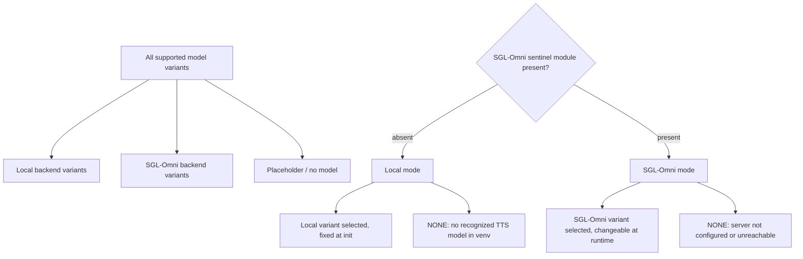

# TTS Type Refactor TODO

## Problem

[`TtsModelType`](../tts_audiobook_tool/tts_models/tts_model_type.py) is currently both the full catalog of supported model variants and an implicit catalog of SGL-Omni-backed variants via [`TtsModelSpec.is_sgl_omni`](../tts_audiobook_tool/tts_models/tts_model_type.py:17).

That means the list is doing double duty:

1. Model identity: which TTS variant is selected.
2. Backend grouping: whether that variant is local inference or SGL-Omni-backed.

This distinction leaks into callers such as:

- [`Tts.is_sgl_mode()`](../tts_audiobook_tool/tts.py:189)
- [`Tts.is_local_model()`](../tts_audiobook_tool/tts.py:185)
- [`Tts.init_local_model_type()`](../tts_audiobook_tool/tts.py:116)
- [`OptionsMenu.sgl_omni_type_menu()`](../tts_audiobook_tool/menus/options_menu.py:306)
- [`Prefs.sgl_omni_type`](../tts_audiobook_tool/prefs.py:471)
- generation UI branches in [`generate_menu.py`](../tts_audiobook_tool/menus/generate_menu.py)

The core smell is that SGL-Omni is a backend category, not really a model category.

A related smell: the SGL-backed variants already carry a `server_*` id prefix in the model identity (`server_fish_s2`, `server_higgs_v3`, `server_moss`, `server_qwen3tts`, `server_zonos2`), with a matching `*_server_*.py` module for each. So "server" is already an implicit backend signal living inside model identity. Once an explicit `backend_kind` exists, that prefix becomes redundant *as a signal* — but the `id` values are a serialization contract, persisted to `prefs.json` ([`Prefs`](../tts_audiobook_tool/prefs.py:615)), so renaming or retiring the existing `server_*` ids would break saved preferences on upgrade. Decision: keep the ids as-is (stable, unique, self-describing) and let `backend_kind` carry the classification; the `*_server_*.py` module names stay for the same reason.

## Desired distinction

Formalize these as separate concepts:

1. Model identity: the selected app-level TTS variant.
2. Backend kind: how the variant is executed or served — a *static* property of a catalog member (see the proposed model metadata changes).
3. Backend mode: how the *process* is running — strictly binary (local or SGL-Omni), determined at startup by the presence of the SGL-Omni sentinel module, and immutable for the life of the process (see the backend mode section).
4. Selection state: which catalog member — including the `NONE` placeholder, meaning "no model" — is currently active within the backend mode.

```mermaid
flowchart TD
    Catalog[All supported model variants] --> Local[Local backend variants]
    Catalog --> Sgl[SGL-Omni backend variants]
    Catalog --> None[Placeholder / no model]

    Sentinel{SGL-Omni sentinel module present?} -->|absent| LocalMode[Local mode]
    Sentinel -->|present| SglMode[SGL-Omni mode]

    LocalMode --> SelLocal[Local variant selected, fixed at init]
    LocalMode --> SelNoneLocal[NONE: no recognized TTS model in venv]

    SglMode --> SelSgl[SGL-Omni variant selected, changeable at runtime]
    SglMode --> SelNoneSgl[NONE: server not configured or unreachable]
```

Note 1: `None` in the diagram is a placeholder member of the same `TtsModelType` enum, not a separate catalog — and "no model" is a *selection state within each backend mode*, not a third mode.
Note 2: the sentinel is the marker package `tts_audiobook_tool_sgl_omni_marker` installed by [`requirements-sgl-omni.txt`](../requirements-sgl-omni.txt); see the backend mode section.

## Recommended direction

Keep [`TtsModelType`](../tts_audiobook_tool/tts_models/tts_model_type.py:68) as the canonical app-level model catalog, but make backend classification explicit.

Avoid immediately splitting [`TtsModelType`](../tts_audiobook_tool/tts_models/tts_model_type.py:68) into separate unrelated enums. The app still needs one canonical selected model identity for serialization, menus, voice settings, project fields, and generation. A full split would likely increase adapter code.

Instead, use one canonical model catalog plus explicit backend classification.

## Backend mode and sentinel probe

The SGL-Omni client path is pure HTTP over the base app dependencies — it needs no model libraries of its own (see the comment in [`requirements-sgl-omni.txt`](../requirements-sgl-omni.txt)). A venv therefore cannot be identified as SGL-Omni-intended by any functional package, so the repo ships an artificial marker: the zero-dependency package [`tts_audiobook_tool_sgl_omni_marker`](../launcher_markers/sgl_omni/tts_audiobook_tool_sgl_omni_marker/__init__.py), installed only by [`requirements-sgl-omni.txt`](../requirements-sgl-omni.txt) (i.e. into [`venv-client`](../.agents/venv-models.md)). The marker is currently inert — nothing in the app code references it yet.

This refactor wires it up:

- **Probe once at startup, before any model initialization:** `util.find_spec("tts_audiobook_tool_sgl_omni_marker")` — the same primitive [`Tts.init_local_model_type()`](../tts_audiobook_tool/tts.py:116) already uses for `local_module_test` ([tts.py:142](../tts_audiobook_tool/tts.py:142)).
- **Set an immutable process-level `backend_mode`** (`LOCAL` / `SGL_OMNI`) from the probe result, stored as a class-level constant on [`Tts`](../tts_audiobook_tool/tts.py) (or [`SglOmniUtil`](../tts_audiobook_tool/app_support/sgl_omni_util.py)).
- **In SGL-Omni mode, skip the local model probe entirely.** In `venv-client` it would find nothing anyway, and in a dual-capable venv (marker plus a local model library) the invariant says SGL-Omni mode wins, so the local model must not be selected. The "more than one model" startup exit ([start.py:121](../tts_audiobook_tool/start.py:121)) becomes local-mode-only.
- **In local mode, SGL-Omni is inert:** no URL probing or auto-detect in [`Tts.update_tts_type()`](../tts_audiobook_tool/tts.py:675), no SGL menu options, and [`Tts.set_sgl_omni_type()`](../tts_audiobook_tool/tts.py:178) is a no-op on runtime state (the prefs value still persists, so a later venv switch simply works).

Consequences to keep on record:

- **SGL-Omni becomes strictly a venv choice.** Today a `venv-base` user with a saved `sgl_omni_url` can still reach a server, since the base dependencies suffice. Under this invariant that path closes unless the marker is present; a user who wants SGL-Omni from a plain venv must install the marker venv. This is a deliberate policy, consistent with the one-venv-one-model layout in [.agents/venv-models.md](../.agents/venv-models.md).
- **Dual-capable venvs (marker plus a local model library) are SGL-Omni-priority.** Current code does the opposite (local wins, SGL hidden). Per [.agents/venv-models.md](../.agents/venv-models.md) a dual venv is a user-error state; SGL-priority is the default, and inverting the priority would be a one-line policy change if ever wanted.

## Proposed model metadata changes

Add a backend enum, for example:

- [`TtsBackendKind.LOCAL`](../tts_audiobook_tool/tts_models/tts_model_type.py)
- [`TtsBackendKind.SGL_OMNI`](../tts_audiobook_tool/tts_models/tts_model_type.py)

Do **not** add a `TtsBackendKind.NONE` member. "No active TTS" is a *runtime* state, not a way of executing a variant: [`TtsModelType.NONE`](../tts_audiobook_tool/tts_models/tts_model_type.py:74) is a catalog placeholder, not a model with a backend. Give the `NONE` placeholder an explicit sentinel: `backend_kind: Optional[TtsBackendKind]`, set to `None` on the placeholder and documented as *not* a real backend. Do not add a third `UNSET`/`NONE` member to the enum: the placeholder is the only state that has no backend, so `None` on the `Optional` field encodes the three-state space (placeholder / local / SGL-Omni) exactly, and the type system forces every read site to handle it. This keeps "backend kind" (a property of a model variant) separate from "no active TTS" (a runtime state), which is exactly the distinction the runtime section below wants to preserve.

Semantics note: `LOCAL` means "executes in the model's local virtualenv," not "runs on a local device." Some local models do not take a torch device parameter at all (e.g., [`MIRA`](../tts_audiobook_tool/tts_models/tts_model_type.py:370), which has an empty `local_torch_devices` list) and are still local models.

Replace:

- [`TtsModelSpec.is_sgl_omni`](../tts_audiobook_tool/tts_models/tts_model_type.py:17)

With something like:

- [`TtsModelSpec.backend_kind`](../tts_audiobook_tool/tts_models/tts_model_type.py)

Then call sites can ask what backend kind a model uses instead of checking an SGL-specific boolean.

## Proposed SGL-specific metadata changes

[`TtsModelSpec.server_model_id_substring`](../tts_audiobook_tool/tts_models/tts_model_type.py:19) is currently only meaningful for SGL-Omni matching.

Options:

1. Rename it to make the scope explicit, such as [`TtsModelSpec.sgl_omni_model_id_substring`](../tts_audiobook_tool/tts_models/tts_model_type.py).
2. Move it into a nested SGL-specific metadata object, such as [`TtsModelSpec.sgl_omni`](../tts_audiobook_tool/tts_models/tts_model_type.py).
3. Move SGL model-id matching into a registry co-located with [`SglOmniUtil`](../tts_audiobook_tool/app_support/sgl_omni_util.py:17), which already centralizes SGL runtime state (base URL, model id, readiness).

Matching fragility: the current matcher, [`TtsModelType.find_tts_type_using_sgl_omni_model_id()`](../tts_audiobook_tool/tts_models/tts_model_type.py:739), does naive substring matching against short prefixes (`"fish"`, `"higgs"`, `"qwen"`, ...). Because the endpoint serves one model at a time, the realistic risk is not two models exposed simultaneously, but a *single* served model id that contains another variant's prefix:

- `fishaudio/s1-mini` (a different Fish model) matches `"fish"` and resolves to [`FISH_S2_SERVER`](../tts_audiobook_tool/tts_models/tts_model_type.py:200)
- `bosonai/higgs-audio-v2-*` matches `"higgs"` and resolves to [`HIGGS_V3_SERVER`](../tts_audiobook_tool/tts_models/tts_model_type.py:302) — a v2 model treated as v3
- any future `Qwen/...` LLM id matches `"qwen"` and resolves to [`QWEN3TTS_SERVER`](../tts_audiobook_tool/tts_models/tts_model_type.py:600)

That mis-match risk — not just future "dynamic discovery" — is the concrete trigger for graduating to option 3. As a cheap stopgap that does not require the registry, the existing matcher can be made to prefer the *longest* matching substring among variants (first match in enum order as today's de-facto tiebreak) so that a more specific prefix wins.

For a first pass, a rename (option 1) is probably enough.

## Proposed catalog helpers

Replace scattered backend checks with named catalog queries.

The primary API should be the spec field itself, `spec.backend_kind`; class-level helpers are conveniences on top, not the main query.

Potential helpers:

- [`TtsModelType.get_items_by_backend()`](../tts_audiobook_tool/tts_models/tts_model_type.py)
- [`TtsModelType.get_local_items()`](../tts_audiobook_tool/tts_models/tts_model_type.py)
- [`TtsModelType.get_sgl_omni_items()`](../tts_audiobook_tool/tts_models/tts_model_type.py:731)
- [`TtsModelType.is_backend()`](../tts_audiobook_tool/tts_models/tts_model_type.py)
- [`TtsModelType.is_valid_sgl_omni_type()`](../tts_audiobook_tool/tts_models/tts_model_type.py) — predicate for the SGL-type validation that is currently triplicated (see plan step 2)

[`TtsModelType.get_sgl_omni_items()`](../tts_audiobook_tool/tts_models/tts_model_type.py:731) already exists, but it is currently implemented by checking [`TtsModelSpec.is_sgl_omni`](../tts_audiobook_tool/tts_models/tts_model_type.py:17). After the refactor, it should be implemented in terms of [`TtsModelSpec.backend_kind`](../tts_audiobook_tool/tts_models/tts_model_type.py).

## Runtime terminology cleanup

[`Tts.is_sgl_mode()`](../tts_audiobook_tool/tts.py:189) is currently misleading: it is derived from the *selection* (`not is_local_model()`), not from the environment, so the name "mode" is a misnomer. In particular, [`TtsModelType.NONE`](../tts_audiobook_tool/tts_models/tts_model_type.py:74) currently counts as this mode in *any* venv — including local venvs where the sentinel is absent and SGL-Omni simply was not set up.

Potential replacements depend on intended behavior:

- [`Tts.is_server_tts_active()`](../tts_audiobook_tool/tts.py)
- [`Tts.uses_remote_backend()`](../tts_audiobook_tool/tts.py)
- [`Tts.should_show_sgl_omni_options()`](../tts_audiobook_tool/tts.py)
- [`Tts.is_local_model_active()`](../tts_audiobook_tool/tts.py)

Note: every current call site of [`is_sgl_mode()`](../tts_audiobook_tool/tts.py:189) tests the *server-facing surface* — true when a SGL-Omni variant is selected **or** when no local model is active (i.e. the `NONE` placeholder counts, which is why the menu still offers the SGL-Omni URL prompt and the heading can read "SGL-Omni offline"). It is defined today as `not is_local_model()`. Once the backend mode exists, redefining this method as `backend_mode == SGL_OMNI` changes the truth table in exactly one cell: **(local mode, `NONE`)** — today "sgl surface" (URL prompt offered), henceforth "no capability" (no SGL prompt; the venv was not set up for SGL-Omni). That flip is the *intent* of the mode invariant, not a side effect; every other cell keeps today's behavior. The existing name is kept, and it becomes literally accurate for the first time. By contrast, a rename to a name meaning "server model is actually active" (e.g. `is_server_tts_active()` — false for `NONE` in *either* mode) would flip many more cells, silently removing the URL prompt exactly when it is most needed, and remains **not** a drop-in replacement; a separate "server model is active" predicate (SGL selection only) should only be introduced if a call site that genuinely needs it appears.

The replacement should not hide the distinction between:

1. No local model found.
2. SGL-Omni URL configured but no model detected yet.
3. A known SGL-Omni-backed model is selected.

## Suggested incremental plan

Implementation note: steps 1, 3, and 4 are most valuable as a **single pass**. The `TtsBackendKind` enum earns its churn (~19 spec constructions plus a dozen read sites) mainly through what it does *not* do alone: as an `Optional` field it encodes the three-state space (placeholder / local / SGL-Omni) in one typed value and forces every read site to handle the placeholder. In combination with the field rename (step 3) and the runtime predicate cleanup (step 4), it retires the scattered `is_sgl_omni` / `== NONE` re-derivations; done alone it is mostly churn. The existing test suite (run under `venv-base`; see `.agents/venv-models.md`) is the fence: it pins the prefs load round-trip, that an explicitly selected SGL-Omni type is never overridden by auto-detection in [`Tts.update_tts_type()`](../tts_audiobook_tool/tts.py:675), and the id-based matching. One intentional behavior change lands against this fence: the (local-mode, `NONE`) cell loses its SGL-Omni surface (see step 4), so any test that exercises the placeholder state in a venv without the sentinel gets its expectations updated deliberately, as part of step 4.

### 1. Add backend classification

- Add [`TtsBackendKind`](../tts_audiobook_tool/tts_models/tts_model_type.py) with `LOCAL` and `SGL_OMNI` members only (no `NONE`).
- Add [`TtsModelSpec.backend_kind`](../tts_audiobook_tool/tts_models/tts_model_type.py).
- Convert local models to [`TtsBackendKind.LOCAL`](../tts_audiobook_tool/tts_models/tts_model_type.py).
- Convert server models to [`TtsBackendKind.SGL_OMNI`](../tts_audiobook_tool/tts_models/tts_model_type.py).
- Give the [`TtsModelType.NONE`](../tts_audiobook_tool/tts_models/tts_model_type.py:74) placeholder an explicit "not a real backend" sentinel.
- Probe the SGL-Omni sentinel (`tts_audiobook_tool_sgl_omni_marker`) once at startup, before model initialization, and set the immutable process-level `backend_mode` (see the backend mode section).
- Keep the `server_*` ids (they are a serialization contract in `prefs.json` — see the Problem section). `backend_kind` carries the classification; the prefix becomes purely cosmetic.

### 2. Replace boolean checks

Replace checks like:

- [`item.value.is_sgl_omni`](../tts_audiobook_tool/tts_models/tts_model_type.py:734)
- [`Tts.get_type().value.is_sgl_omni`](../tts_audiobook_tool/menus/menu_status.py:24)

With explicit backend predicates or helper methods.

Also collapse the SGL-type validation that is currently triplicated. The guard `value == TtsModelType.NONE or not value.value.is_sgl_omni` appears in:

- [`Tts.set_sgl_omni_type()`](../tts_audiobook_tool/tts.py:178)
- the [`Prefs.sgl_omni_type` setter](../tts_audiobook_tool/prefs.py:475)
- the [`Prefs` load path](../tts_audiobook_tool/prefs.py:238)

All three should route through a single catalog predicate such as [`TtsModelType.is_valid_sgl_omni_type()`](../tts_audiobook_tool/tts_models/tts_model_type.py). The predicate itself is a plain boolean; the call sites keep their own fallback behavior: [`Tts.set_sgl_omni_type()`](../tts_audiobook_tool/tts.py:178) and the [`Prefs.sgl_omni_type` setter](../tts_audiobook_tool/prefs.py:475) both just guard and delegate to the same target (the setter's current inline check duplicates the guard — drop it), while the [`Prefs` load path](../tts_audiobook_tool/prefs.py:238) keeps its invalid-value → `None` + dirty-flag semantics.

### 3. Rename SGL-specific fields

- Rename [`TtsModelSpec.server_model_id_substring`](../tts_audiobook_tool/tts_models/tts_model_type.py:19) to something SGL-specific.
- Update [`TtsModelType.find_tts_type_using_sgl_omni_model_id()`](../tts_audiobook_tool/tts_models/tts_model_type.py:739) accordingly.

### 4. Clarify runtime methods

- Redefine [`Tts.is_sgl_mode()`](../tts_audiobook_tool/tts.py:189) as `backend_mode == SGL_OMNI` (sentinel-derived) instead of `not is_local_model()` (selection-derived) — see the note in the runtime terminology section.
- The behavior changes in exactly one cell: **(local mode, `NONE`)** no longer gets the SGL-Omni surface (URL prompt, menu options, auto-detect) and becomes the "no model capability" state with a mode-aware hint. Every other cell keeps today's behavior. Introduce a separate "server model is active" predicate only if a call site that needs it appears.
- Gate [`Tts.update_tts_type()`](../tts_audiobook_tool/tts.py:675) on mode: local mode → early return (no URL probing, no auto-detect); SGL mode → current logic unchanged.
- [`Tts.set_sgl_omni_type()`](../tts_audiobook_tool/tts.py:178) is a no-op on runtime state in local mode (the prefs value still persists).
- Update menus and status display accordingly.

### 5. Consider a separate SGL registry later

[`SglOmniUtil`](../tts_audiobook_tool/app_support/sgl_omni_util.py:17) already centralizes SGL runtime state (base URL, model id, readiness). The remaining smell is that SGL-specific *matching* metadata (`server_model_id_substring`) lives on the generic `TtsModelSpec` while SGL *runtime* behavior lives in `SglOmniUtil`. The end-state is therefore better framed as co-locating SGL-specific matching metadata with `SglOmniUtil` (e.g., in a registry) than as inventing a new registry from scratch.

Only take that step if SGL-Omni grows features such as:

- model-id match mis-fires (a single served model id containing another variant's prefix — see the matching-fragility note above; the current substring matcher cannot distinguish)
- dynamic discovery
- capabilities from the server
- endpoint-specific readiness checks
- backend-specific model aliases
- richer server model matching

A second, non-SGL trigger exists on the *duplication* axis, not the matching axis: local/server "member pairs" (e.g. [`MOSS`](../tts_audiobook_tool/tts_models/tts_model_type.py:404) / [`MOSS_SERVER`](../tts_audiobook_tool/tts_models/tts_model_type.py:436), [`QWEN3TTS`](../tts_audiobook_tool/tts_models/tts_model_type.py:570) / [`QWEN3TTS_SERVER`](../tts_audiobook_tool/tts_models/tts_model_type.py:600), [`FISH_S2`](../tts_audiobook_tool/tts_models/tts_model_type.py:168) / [`FISH_S2_SERVER`](../tts_audiobook_tool/tts_models/tts_model_type.py:200)) duplicate behavior knowledge (sample rate, word-count limits, substitutions, streaming) by copy, and the underlying-model "family" they share is deliberately left untyped by this plan. If those copies start diverging in a way that copy-editing cannot keep honest, that is a trigger of its own — for a family-level base spec or pairing metadata, *in addition to* (not instead of) the matching registry above. The hardcoded sample-rate fallbacks in [`SglOmniUtil`](../tts_audiobook_tool/app_support/sgl_omni_util.py) ([`HIGGS_V3_SERVER.value.sample_rate`](../tts_audiobook_tool/app_support/sgl_omni_util.py:258), [`QWEN3TTS_SERVER.value.sample_rate`](../tts_audiobook_tool/app_support/sgl_omni_util.py:272)) survive the rename but are a symptom of the same spec/registry boundary and can be absorbed if this step fires.

Until then, backend classification in the main model catalog should be sufficient.

## Adjacent defects to fix along the way

Independent of the taxonomy, these live in the paths this refactor touches and should be fixed in the same pass:

- [`Tts.get_instance_if_exists()`](../tts_audiobook_tool/tts.py:399): the `FISH_S2_SERVER` slot maps to `Tts._fish_s2` (the *local* instance) instead of `Tts._fish_s2_server` ([tts.py:404](../tts_audiobook_tool/tts.py:404)). This is one of three parallel `MAP` dicts (`get_class`, `get_instance`, `get_instance_if_exists`) that would be worth consolidating into one while the area is already open.
- [`Tts.clear_tts_model()`](../tts_audiobook_tool/tts.py:640): nulls 16 of the 18 instance attributes, missing `_fish_s2_server` and `_moss_server` ([tts.py:644-659](../tts_audiobook_tool/tts.py:644)). Harmless today only because those server models are stateless (`kill()` is a `pass`); it becomes a real leak the moment a server model holds resources.
- The [`TtsModelType.NONE`](../tts_audiobook_tool/tts_models/tts_model_type.py:74) placeholder's `requirements_file_name` is set to `"requirements-sgl-omni.txt"` ([tts_model_type.py:93](../tts_audiobook_tool/tts_models/tts_model_type.py:93), flagged with a `# TODO: address entangled abstractions`). The entanglement is now nameable: one placeholder state serves two meanings that need different hints. The no-model hint at [`start.py:185`](../tts_audiobook_tool/start.py:185) becomes **mode-aware**: in SGL-Omni mode the placeholder's sgl-omni requirements file is *correct* (server not configured → install the marker venv / set the URL); in local mode it is wrong (no recognized TTS model in the venv → point at a local model's requirements file).
- The inline `is_sgl_mode` equivalent at [`menu_status.py:24`](../tts_audiobook_tool/menus/menu_status.py:24) and the heading logic at [`main_menu.py:99`](../tts_audiobook_tool/menus/main_menu.py:99) should move onto the redefined predicate from step 4, so the three-state wording lives in one place.
- The torch-flavor exit at [`start.py:131`](../tts_audiobook_tool/start.py:131) is gated on `Tts.get_type().value.is_sgl_omni` — *selection*-derived. In an SGL-Omni venv with no URL set yet, the type is `NONE` and the "wrong torch flavor" nag fires in a venv that does not need CUDA at all. Gate it on the **backend mode** instead.

## Target outcome

The app should read as:

- model catalog logic lives in [`TtsModelType`](../tts_audiobook_tool/tts_models/tts_model_type.py:68)
- backend classification lives in [`TtsModelSpec.backend_kind`](../tts_audiobook_tool/tts_models/tts_model_type.py)
- SGL-Omni-specific matching lives behind explicitly named SGL helpers
- runtime state methods say exactly what state they test
- `server_*` model ids remain the stable serialization contract; backend meaning comes from `backend_kind`, not from the id or module names
- the backend mode is a startup-time process invariant (sentinel-determined); all SGL-Omni-specific behavior is gated on it

This should make the SGL-Omni branch legible without turning [`TtsModelType`](../tts_audiobook_tool/tts_models/tts_model_type.py:68) into an implicit subgrouping mechanism.
